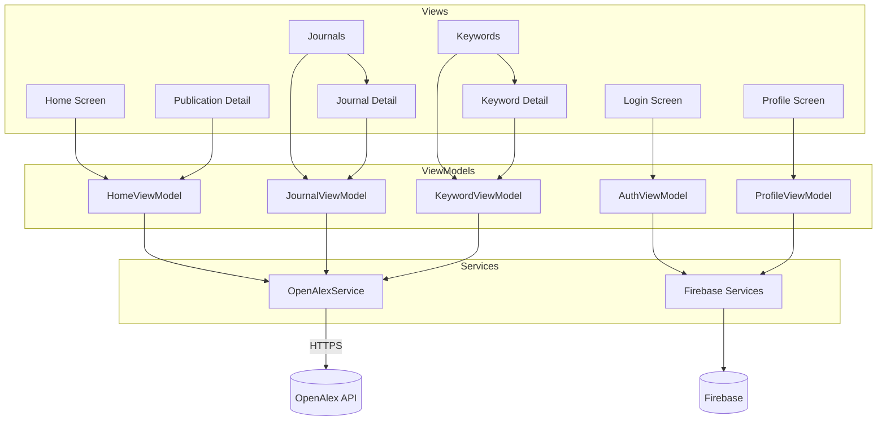

# PRM393 Lab 03 – Phân tích đề bài: Firebase-Powered Journal Trend Analyzer

> **Môn học:** Mobile Programming (PRM393)
> **Đề tài:** Mở rộng Journal Trend Analyzer (Lab 02) với Firebase + Patrol + AI code review
> **Nguồn dữ liệu:** [OpenAlex API](https://developers.openalex.org/api-reference/introduction)
> **Nền tảng cloud:** Firebase
> **Công nghệ:** Flutter + Dart

---

## 1. Tổng quan

Lab 03 **không phải làm lại từ đầu**. Ứng dụng Lab 02 (search topic → phân tích xu hướng công bố từ OpenAlex) được giữ nguyên làm nền, và bổ sung ba trục mới:

1. **Cloud (Firebase)** — auth, storage, push notification, analytics, crash monitoring, remote config.
2. **Chất lượng phần mềm** — E2E test tự động bằng Patrol, AI-assisted code review.
3. **Kiến trúc** — bắt buộc tuân thủ MVVM, business logic không nằm trong UI.

Trọng tâm chấm điểm dịch chuyển rõ rệt: **Firebase (25%) + Patrol (15%) = 40%**, gần bằng phần chức năng (30%). Làm đủ FR nhưng thiếu Firebase/Patrol sẽ mất điểm rất nặng.

---

## 2. Mục tiêu học tập

| # | Mục tiêu | Liên hệ triển khai |
|---|----------|-------------------|
| 1 | Tích hợp Firebase vào Flutter | `firebase_core` + `flutterfire configure` |
| 2 | Authentication với Google Sign-In | `firebase_auth` + `google_sign_in` |
| 3 | Upload & quản lý file | `firebase_storage` |
| 4 | Push notification | `firebase_messaging` (FCM) |
| 5 | Theo dõi hành vi người dùng | `firebase_analytics` |
| 6 | Giám sát crash | `firebase_crashlytics` |
| 7 | Cấu hình động | `firebase_remote_config` |
| 8 | E2E testing | `patrol` |
| 9 | AI-assisted code review | CodeRabbit / Copilot Review / SonarQube / Kodus AI |
| 10 | Kiến trúc maintainable | MVVM: Model – Service – ViewModel – View |

---

## 3. Yêu cầu chức năng (FR)

### 3.1 User Authentication (4.1)

Firebase Authentication với **Google Sign-In**. Người dùng phải:

- Đăng nhập bằng tài khoản Google
- Xem thông tin tài khoản đã xác thực
- Đăng xuất

Kéo theo: cần **Login Screen** và cơ chế redirect — chưa đăng nhập thì không vào được 4 tab chính. Với `go_router` hiện tại, cài `redirect` dựa trên `FirebaseAuth.instance.authStateChanges()`.

### 3.2 Home (4.2)

Dashboard tổng quan cho **một topic đã chọn**. Phải hiển thị đủ:

| Chỉ số | Cách tính |
|--------|-----------|
| Total publications | `meta.count` từ search |
| Average citation count | Trung bình `cited_by_count` |
| Most active publication year | Năm có count lớn nhất |
| Top contributing author | Author xuất hiện nhiều nhất |
| Top journal | Journal có nhiều publication nhất |
| Most influential publication | Work có `cited_by_count` max |

Cộng thêm: ô search theo topic, **biểu đồ xu hướng theo thời gian**, và tap vào publication → điều hướng sang Publication Detail.

### 3.3 Publication Details (4.3)

Title · Authors · Publication year · Journal name · Citation count · DOI · Abstract (khi có) · **link tới bài gốc** (khi có).

Abstract của OpenAlex ở dạng `abstract_inverted_index` — cần decode. Repo đã có `core/utils/abstract_decoder.dart`.

### 3.4 Journals (4.4)

Phân tích cấp journal cho topic đang chọn:

- Top journals xếp theo số publication
- Thống kê publication theo từng journal
- Biểu đồ đóng góp của journal
- Thống kê citation theo journal
- Tap journal → **Journal Detail**

Gợi ý API: `group_by=primary_location.source.id`, hoặc đếm frequency client-side từ tập works đã fetch.

### 3.5 Journal Details (4.5)

Tên journal · Tổng số publication · Tổng citation · Trung bình citation/publication · Danh sách publication liên quan.

### 3.6 Keywords (4.6)

- Keyword xuất hiện nhiều nhất
- Keyword đang trending
- Thống kê tần suất keyword
- Biểu đồ xu hướng keyword
- Tap keyword → **Keyword Detail**

Nguồn keyword trong OpenAlex: `keywords[]`, `concepts[]`, hoặc `topics[]` của mỗi work.

### 3.7 Keyword Details (4.7)

Với một keyword đã chọn:

- Xu hướng công bố theo thời gian
- Journal liên quan
- Publication liên quan
- **Top contributing authors** + số publication mỗi author
- Danh sách hoặc biểu đồ xếp hạng author

> Đề bài nói rõ: **author phải sắp giảm dần theo số publication gắn với keyword đó.**

### 3.8 Profile (4.8)

Màn hình này là nơi "trưng bày" Firebase. Bốn khối:

**User Information** — ảnh đại diện, tên, email, nút Sign Out.

**Notification Center** — hiển thị notification nhận từ FCM. Ví dụ: topic nghiên cứu mới nổi, cảnh báo publication được trích dẫn nhiều, cập nhật xu hướng.

**Report Export** — export dashboard analytics ra **PDF**, upload lên **Firebase Storage**, hiển thị URL file đã upload.

**Remote Config Demo** — đọc và hiển thị **ít nhất 2 giá trị** cấu hình. Ví dụ: `max_journals_displayed`, `max_keywords_displayed`.

**Crashlytics Demo** — một nút sinh *handled exception* (`recordError`), một nút sinh *test crash* (`crash()`).

---

## 4. Yêu cầu Firebase (Mục 5)

| Dịch vụ | Mục đích |
|---------|----------|
| Firebase Authentication | Google Sign-In |
| Firebase Storage | Lưu PDF report đã export |
| Firebase Cloud Messaging | Push notification |
| Firebase Analytics | Theo dõi hành vi người dùng |
| Firebase Crashlytics | Giám sát crash |
| Firebase Remote Config | Cấu hình động |

### 4.1 Analytics events bắt buộc

| Event | Parameters | Trigger |
|-------|-----------|---------|
| `login` | — | Đăng nhập thành công |
| `search_topic` | `keyword` | Search một topic |
| `view_publication` | `publication_title`, `publication_year` | Mở publication detail |
| `view_journal` | `journal_name` | Mở journal detail |
| `view_keyword` | `keyword` | Mở keyword detail |
| `export_pdf` | `topic` | Export + upload PDF |
| `logout` | — | Đăng xuất |

**Bằng chứng event đã ghi nhận phải đưa vào report** — chụp DebugView hoặc Events dashboard.

> **Gợi ý triển khai:** gom vào một `AnalyticsService` duy nhất với 7 method, gọi từ ViewModel — không rải `FirebaseAnalytics.instance` khắp widget. Vừa dễ test, vừa tránh code smell khi AI review.

---

## 5. Yêu cầu kỹ thuật (Mục 6)

App phải: viết bằng Flutter/Dart · lấy dữ liệu trực tiếp từ OpenAlex · gọi API bất đồng bộ · xử lý loading + error đầy đủ · cấu trúc project rõ ràng · dùng state management phù hợp · chạy được trên Android device và emulator.

### 5.1 Kiến trúc MVVM

Đề bài yêu cầu tách bạch **Models / Services / ViewModels / Views**, và **business logic không được nằm trong UI screen**.

Cấu trúc gợi ý trong đề:

```
lib/
├── models/
├── services/
├── firebase/
├── viewmodels/
├── screens/
├── widgets/
└── utils/
```

### 5.2 ⚠️ Điểm lệch cần quyết định: state management

Đề bài ghi **"Students may use either: Provider / Riverpod"**, và tiêu chí chấm ghi *"Architecture (MVVM + Provider/Riverpod) — 10%"*.

Repo hiện tại dùng **`flutter_bloc` (Cubit)** + `get_it` + Clean Architecture, kế thừa từ Lab 02.

Ba lựa chọn:

| Phương án | Đánh giá |
|-----------|----------|
| **A. Giữ Bloc/Cubit, giải trình trong report** | Cubit *là* ViewModel về mặt vai trò. Rủi ro mất một phần 10% nếu giảng viên chấm theo chữ. Rẻ nhất về công sức. |
| **B. Chuyển toàn bộ sang Provider/Riverpod** | Đúng chữ đề bài, an toàn nhất về điểm. Tốn công refactor mọi cubit hiện có. |
| **C. Giữ Cubit cho phần OpenAlex, dùng Riverpod cho phần Firebase mới** | Trộn hai state management → chính là code smell mà AI review sẽ bắt. **Không khuyến nghị.** |

**Khuyến nghị: hỏi giảng viên trước.** Nếu không hỏi được, chọn **B** — 10% architecture cộng với việc AI review sẽ soi kiến trúc, đáng để refactor sớm hơn là sửa muộn.

### 5.3 Ánh xạ Clean Architecture ↔ MVVM

Nếu giữ cấu trúc hiện tại, cần trình bày rõ trong report:

| MVVM | Trong repo |
|------|-----------|
| Model | `domain/entities/` + `data/models/` |
| Service | `data/datasources/` + `core/network/api_client.dart` |
| ViewModel | `presentation/cubit/` |
| View | `presentation/pages/` + `presentation/widgets/` |

Firebase nên đặt thành một nhóm service riêng, ví dụ `core/firebase/` hoặc `lib/firebase/`: `AuthService`, `StorageService`, `MessagingService`, `AnalyticsService`, `CrashlyticsService`, `RemoteConfigService`. Đăng ký tất cả trong `core/di/injection.dart`.

---

## 6. Yêu cầu giao diện (Mục 7)

**Tối thiểu 8 màn hình:**

| # | Màn hình | FR | Trạng thái repo |
|---|----------|-----|-----------------|
| 1 | Login Screen | 4.1 | ⬜ chưa có |
| 2 | Home Screen | 4.2 | ✅ `home_page.dart` |
| 3 | Publication Detail Screen | 4.3 | ✅ `publication_detail_page.dart` |
| 4 | Journals Screen | 4.4 | ✅ `journal_page.dart` |
| 5 | Journal Detail Screen | 4.5 | ⬜ chưa có |
| 6 | Keywords Screen | 4.6 | ✅ `keywords_page.dart` |
| 7 | Keyword Detail Screen | 4.7 | ⬜ chưa có |
| 8 | Profile Screen | 4.8 | ⚠️ có, nhưng chưa có phần Firebase |

**Bottom Navigation Bar** 4 tab: Home · Journals · Keywords · Profile — repo đã có (`StatefulShellRoute.indexedStack` trong `core/router/app_router.dart`).

UI phải responsive, nhất quán về thị giác, dễ điều hướng.

---

## 7. Automated Testing với Patrol (Mục 8) — 15%

11 test case bắt buộc:

| TC | Kịch bản | Kiểm chứng |
|----|---------|-----------|
| 1 | Google Sign-In | Mở app → đăng nhập → về Home |
| 2 | Topic Search | Nhập topic → search → thấy kết quả |
| 3 | Publication Details | Mở 1 publication → thông tin hiển thị đúng |
| 4 | Journals Navigation | Sang tab Journals → thấy thống kê + list |
| 5 | Journal Details | Mở 1 journal → chi tiết hiển thị đúng |
| 6 | Keywords Navigation | Sang tab Keywords → thấy thống kê + list |
| 7 | Keyword Details | Mở 1 keyword → thấy thông tin phân tích |
| 8 | Profile Navigation | Sang tab Profile → thấy thông tin user |
| 9 | PDF Export | Sinh PDF → upload Storage → upload thành công |
| 10 | Remote Config | Lấy config → giá trị hiển thị |
| 11 | Logout | Đăng xuất → quay về Login |

Cấu trúc thư mục gợi ý:

```
patrol_tests/
├── authentication_test.dart
├── publication_test.dart
├── journal_test.dart
├── keyword_test.dart
├── profile_test.dart
├── export_test.dart
└── remote_config_test.dart
```

**Bằng chứng phải nộp:** screenshot source code test · screenshot lúc chạy test · bảng tổng hợp kết quả · giải thích ngắn từng test case.

> **Lưu ý thực tế:** TC1 phải bấm qua dialog Google Sign-In — đây là **native UI ngoài Flutter**, và chính là lý do đề bài chọn Patrol thay vì `integration_test` (Patrol có `$.native.tap(...)`). Nên thêm `Key` cho các widget chính ngay từ khi code UI, đừng để đến lúc viết test mới đi tìm selector.

---

## 8. AI-Assisted Code Review (Mục 9) — 5%

Công cụ: GitHub Copilot Code Review · CodeRabbit · SonarQube · Kodus AI.

Yêu cầu tối thiểu: phát hiện **≥ 3 issue** (bug, warning, code smell, hoặc cơ hội cải thiện), xử lý khi phù hợp, và tài liệu hoá quy trình bằng **screenshot + giải thích ngắn** trong report.

Những issue AI hay bắt được ở lab Flutter + Firebase:

| Issue | Loại | Hướng xử lý |
|-------|------|-------------|
| Không `dispose()` TextEditingController | Warning | dispose trong State |
| Gọi API trong `build()` | Bug | Chuyển vào ViewModel / `initState` |
| Hard-code API key hoặc Firebase key trong source | Security | `.env` / `--dart-define` |
| Commit `google-services.json` chứa key nhạy cảm | Security | Cân nhắc; đề bài lại yêu cầu nộp file cấu hình → giải trình trong report |
| Không handle null trong JSON | Bug | Nullable type + fallback |
| `BuildContext` dùng sau `await` | Bug | Check `mounted` |
| Widget quá lớn | Smell | Tách widget con |
| Trộn nhiều state management | Smell | Xem mục 5.2 |

---

## 9. Deliverables (Mục 10)

### 9.1 Source code

GitHub repo tên **`PRM393_Lab03_StudentID`**, chứa: source code đầy đủ · file cấu hình Firebase · Patrol test scripts · assets.

### 9.2 Project report (5–10 trang)

Project overview · System architecture · MVVM implementation · Firebase integration design · Screenshot các tính năng · Firebase Analytics events · Crashlytics reports · Remote Config demonstration · Patrol test scenarios & results · AI code review findings · Challenges · Lessons learned.

### 9.3 Demo video (5–10 phút)

Google Sign-In · Topic search · Publication details · Journal analysis · Keyword analysis · Author analysis · PDF export + upload · Push notification · Remote Config · Crashlytics · Patrol test · AI code review.

---

## 10. Thang điểm (Mục 11)

| Tiêu chí | Trọng số |
|----------|---------|
| Functional Requirements | 30% |
| Firebase Integration & Analytics | 25% |
| Patrol Automated Testing | 15% |
| Architecture (MVVM + Provider/Riverpod) | 10% |
| UI/UX and Application Quality | 10% |
| AI-Assisted Code Review | 5% |
| Report and Demonstration | 5% |

**Đọc bảng này như một bản đồ ưu tiên:** Firebase + Patrol chiếm 40%, nhiều hơn cả nhóm chức năng. Đừng dồn hết thời gian polish UI (chỉ 10%).

---

## 11. Kiến trúc đề xuất



`Firebase Services` gồm 6 service tách rời: Auth · Storage · Messaging · Analytics · Crashlytics · RemoteConfig. Mọi ViewModel gọi `AnalyticsService` khi có event tương ứng.

---

## 12. Lộ trình triển khai

| Phase | Công việc | Ưu tiên |
|-------|-----------|---------|
| 0 | **Chốt state management** (mục 5.2) — quyết định sớm, refactor muộn rất đắt | Chặn |
| 1 | `flutterfire configure`, thêm `firebase_core`, app chạy được | Cao |
| 2 | Auth: Login Screen + Google Sign-In + router redirect + Sign Out | Cao |
| 3 | `AnalyticsService` + log `login` / `logout` / `search_topic` | Cao |
| 4 | Journal Detail Screen (FR 4.5) + event `view_journal` | Cao |
| 5 | Keyword Detail Screen + author ranking (FR 4.7) + event `view_keyword` | Cao |
| 6 | Profile: Remote Config demo + Crashlytics demo | Trung bình |
| 7 | PDF export → Firebase Storage → hiển thị URL + event `export_pdf` | Trung bình |
| 8 | FCM + Notification Center | Trung bình |
| 9 | Patrol: setup + 11 test case | Cao (15%) |
| 10 | AI code review + sửa findings + screenshot | Bắt buộc nộp |
| 11 | Report PDF + video demo | Bắt buộc nộp |

Phase 4 và 5 làm được ngay mà chưa cần Firebase — chạy song song với phase 1–3 nếu làm nhóm.

---

## 13. Rủi ro & thách thức

| Thách thức | Giải pháp |
|------------|-----------|
| Bloc ≠ Provider/Riverpod như đề yêu cầu | Chốt ở phase 0; xem mục 5.2 |
| Google Sign-In cần SHA-1 fingerprint | `./gradlew signingReport`, thêm vào Firebase Console; sai SHA-1 → sign-in im lặng thất bại |
| Crashlytics không hiện crash | Crash phải xảy ra rồi **restart app** mới upload được report |
| Patrol test qua native Google dialog | Dùng `$.native.tap()`; cân nhắc test account cố định |
| Test Patrol phụ thuộc mạng/OpenAlex | Chấp nhận flaky, hoặc mock ở tầng service |
| `google-services.json` chứa key | Đề yêu cầu commit; nêu rõ trong report là key client-side, bảo vệ bằng Firebase Security Rules |
| Storage rules mặc định chặn upload | Cấu hình rule cho phép user đã auth ghi vào `reports/{uid}/` |
| Topic trả quá nhiều kết quả | `per_page` + `group_by` phía API |
| Abstract dạng inverted index | Đã có `abstract_decoder.dart` |
| Journal name null | Fallback `"Unknown Source"` |

---

## 14. Checklist tự đánh giá

**Chức năng**

- [ ] Login Screen + Google Sign-In hoạt động
- [ ] Home: search + trend chart + 6 chỉ số dashboard
- [ ] Publication Detail: đủ 7 trường + link bài gốc
- [ ] Journals: ranking + chart + citation stats
- [ ] Journal Detail: 5 mục thông tin
- [ ] Keywords: frequent + trending + chart
- [ ] Keyword Detail: trend + related + author ranking giảm dần
- [ ] Profile: user info + Notification Center + PDF export + Remote Config + Crashlytics
- [ ] Bottom nav 4 tab

**Firebase**

- [ ] Đủ 6 dịch vụ được tích hợp
- [ ] Đủ 7 Analytics event kèm parameter
- [ ] Screenshot bằng chứng event trong DebugView
- [ ] ≥ 2 giá trị Remote Config hiển thị trên UI
- [ ] Crashlytics: handled exception + test crash
- [ ] PDF upload thành công, URL hiển thị

**Chất lượng**

- [ ] MVVM: không có business logic trong screen
- [ ] 11 Patrol test case, có screenshot + bảng kết quả
- [ ] AI code review ≥ 3 findings, có screenshot + giải thích
- [ ] `flutter analyze` sạch
- [ ] App chạy được trên Android device *và* emulator

**Nộp bài**

- [ ] Repo `PRM393_Lab03_StudentID` (source + Firebase config + Patrol tests + assets)
- [ ] Report PDF 5–10 trang, đủ 12 mục
- [ ] Video demo 5–10 phút, đủ 12 nội dung

---

## 15. Tài liệu tham khảo

**OpenAlex** — [Introduction](https://developers.openalex.org/api-reference/introduction) · [Filtering](https://developers.openalex.org/guides/filtering) · [Searching](https://developers.openalex.org/guides/searching) · [Grouping](https://developers.openalex.org/guides/grouping)

**Firebase** — [FlutterFire](https://firebase.flutter.dev/) · [Add Firebase to Flutter](https://firebase.google.com/docs/flutter/setup) · [Analytics events](https://firebase.google.com/docs/analytics/events) · [Remote Config](https://firebase.google.com/docs/remote-config/get-started?platform=flutter) · [Crashlytics](https://firebase.google.com/docs/crashlytics/get-started?platform=flutter)

**Testing** — [Patrol docs](https://patrol.leancode.co/) · [Patrol native automation](https://patrol.leancode.co/native/overview)

**Flutter** — [Documentation](https://docs.flutter.dev/)

---

## 16. Kết luận

Lab 03 kiểm tra năng lực **kỹ sư phần mềm**, không chỉ năng lực **lập trình UI**. Phần OpenAlex đã xong từ Lab 02; điểm số bây giờ nằm ở việc tích hợp cloud đúng cách, kiến trúc tách lớp rõ ràng, và chứng minh chất lượng bằng test tự động + code review.

Ba việc cần làm ngay:

1. **Chốt state management** (Provider/Riverpod hay giữ Bloc) — mọi thứ khác phụ thuộc quyết định này.
2. **Dựng Firebase project và Google Sign-In** — chặn TC1 của Patrol và event `login`.
3. **Thêm `Key` cho widget khi code UI mới** — Patrol test sẽ cần, và thêm sau tốn công gấp đôi.

Hai màn hình còn thiếu — **Journal Detail** và **Keyword Detail** — không phụ thuộc Firebase, có thể làm song song ngay.
